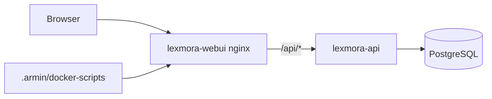

# Architecture (schematic)

```mermaid
flowchart LR
  Browser --> WebUI[lexmora-webui nginx]
  WebUI -->|"/api/*"| API[lexmora-api]
  API --> DB[(PostgreSQL)]
  DeployScripts[.armin/docker-scripts] --> WebUI
```

Browser hits the UI container; nginx serves static assets and proxies `/api` to the API container on shared Docker network `t3-net`.
